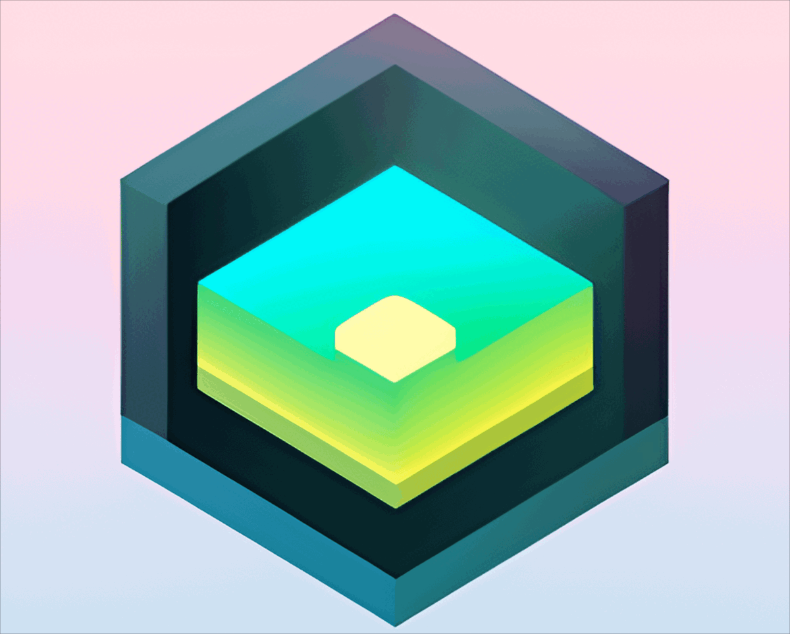

 <!--  |
 --- | ---
console.log("This is KwonYeJun")  |  console.log("This is TOY") -->
# KwonYeJun is a ✨ _special_ ✨ 

<a href="https://mymain-e6d56.web.app/"> 👋 console.log("This is KwonYeJun") </a>

<a href="http://monkeyhappy.kro.kr/">⚡ console.log("This is TOY")  </a>

----

&nbsp;&nbsp;&nbsp;&nbsp;&nbsp;&nbsp;&nbsp;&nbsp;&nbsp;&nbsp;&nbsp;&nbsp;&nbsp;&nbsp;&nbsp;&nbsp;&nbsp;
##  Skill  📫
</a>
</a>
</a>
</a>
</a>
</a>
</a>

</a>
</a>
</a>
</a>
</a>
</a>

<!--
**KwonYeJun/KwonYeJun** is a ✨ _special_ ✨ repository because its `README.md` (this file) appears on your GitHub profile.

Here are some ideas to get you started:

- 🔭 I’m currently working on ...
- 🌱 I’m currently learning ...
- 👯 I’m looking to collaborate on ...
- 🤔 I’m looking for help with ...
- 💬 Ask me about ...
- 📫 How to reach me: ...
- 😄 Pronouns: ...
- ⚡ Fun fact: ...
-->
<!-- 

 <a href="https://mymain-e6d56.web.app/"> 👋 console.log("This is KwonYeJun") </a>  
  
 <a href="http://monkeyhappy.kro.kr/">⚡ console.log("This is TOY") </a>

 -->

  
----
<!--  -->